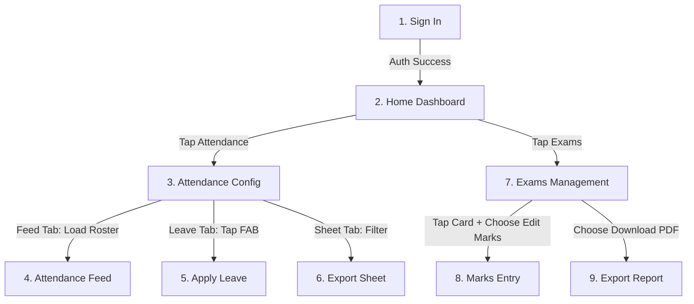

# User Flows Specification: ARMS App

This document details the user flows and screen transitions for the **ARMS (Attendance & Resource Management System)** mobile application, mapped out to ensure high-density "Clean Utility" experiences prioritizing speed, accuracy, and clear visual state tracking.

---

## 1. Flow Overview & Architecture

---

## 2. Detailed User Flows

### Flow 1: Authentication (Sign In)
**Objective:** Provide a fast, secure gateway to user configuration.
1. **Entry Point:** App launched.
2. **Action:** User enters **User ID** and **Password** in the input forms.
   - *Interaction:* User can tap the visibility icon (`visibility_off` / `visibility`) to reveal or obscure the password field.
3. **Action:** User taps the full-pill **Sign In** button.
4. **Validation Branches:**
   - **Case A (Success):** Authenticated. Redirect immediately with a crossfade transition to the **Home Dashboard**.
   - **Case B (Failure):** Display a red error container inline with clear hints (e.g., "Invalid User ID or Password"). Field highlights in `AppColors.errorText`.

---

### Flow 2: Attendance Tracking & Feed Flow

#### 2A: Configuration
1. **Entry Point:** Tap **Attendance** card on Dashboard.
2. **Action:** App lands on **Attendance Configuration** (defaulting to the **Feed** sub-navigation pill).
3. **Configuration Choices:**
   - **Date Selector:** Defaults to today. Clicking opens a date spinner. If a past date is selected, a warning banner appears below it (`Warning: Selecting a past date`).
   - **Session Selector:** Grid selector to pick a radio session: *Morning In*, *Morning Out*, *Evening In*, or *Evening Out*.
   - **Class & Section Dropdown:** Triggers list pick. Selecting an option (e.g., "Grade 10 - Science A") dynamically unlocks the primary button.
4. **Transition:** Tap active **Load Student Roster** button. Navigates to **Attendance Feed**.

#### 2B: Attendance Marking
1. **Entry Point:** Attendance Feed screen loaded.
2. **Action:** List displays a roster of students with details (avatar, name, registration number) and state selector toggles (`P` / `A` buttons).
3. **Roster Interactions:**
   - **Individual Selection:** Tap `P` (Present) -> Button highlights in active blue, matching Absent button dims. Tap `A` (Absent) -> Button highlights in vibrant red.
   - **Bulk Selection:** Tap "All Present" or "All Absent" filters in toolbar to set defaults for all unmarked students.
   - **Undo Action:** Tap "Undo" button to revert the last batch change.
4. **Real-time Counter:** The sticky bottom footer updates counts of *Present*, *Absent*, and *Unmarked* in real time.
5. **Action:** User taps "Save".
   - *Validation:* If any students remain *Unmarked*, a modal confirmation prompts: "You have 1 unmarked student. Save as absent?"
6. **Output:** Success toast -> Navigates back to the configuration screen.

---

### Flow 3: Leave Management & Application Flow

#### 3A: Leave Log Roster
1. **Entry Point:** Tap **Leave** tab on the Attendance configuration view.
2. **Action:** Screen shows the **Leave Management** list with filter pills at the top (*All*, *Approved*, *Pending*, *Rejected*).
3. **Roster View:** Displays leave logs sorted chronologically. Pending items appear at full opacity; Approved and Rejected logs are slightly faded (70% opacity) for scannability.
4. **Action:** User taps the **Floating Action Button (+)** in bottom right to apply a new leave.

#### 3B: Leave Application
1. **Entry Point:** Apply Leave screen loaded.
2. **Action:** User fills out fields:
   - **Student Picker:** Tap search and select a student. A custom profile row populates once chosen.
   - **Date range picker:** Enter From Date and To Date.
   - **Leave type select:** Select from dropdown (Fever, Casual, Marriage, Other).
   - **Reason:** Text area input.
   - **Approval Toggle:** Admin/teacher toggles approved status. If switched to "Rejected", a text input field ("Rejected Reason") is forced to unlock.
   - **Attachment Upload:** Tap paperclip/photo block -> Choose image/document.
3. **Action:** Tap **Apply** button.
4. **Output:** Navigates back to Leave Management list, populating the new item under "Pending Approval".

---

### Flow 4: Attendance Sheet Export Flow
1. **Entry Point:** Tap **Sheet** tab on the Attendance configuration view.
2. **Action:** Screen presents an interactive grid showing calendar days (1–31) horizontally and student rows vertically. Days represent P (Present), A (Absent), L (Leave).
3. **Action:** User taps **Export Sheet** button.
4. **Interaction:** Choose format (Excel or PDF) from selector.
5. **Output:** Triggers system downloader -> Shows standard share sheet upon completion.

---

### Flow 5: Examination & Marks Entry Flow

#### 5A: Exam Management Dashboard
1. **Entry Point:** Tap **Exams** card on Home Dashboard.
2. **Action:** Lands on **Exams Management** listing.
3. **Interactions:**
   - **Search:** Dynamic text searching matches subject or series titles in real time.
   - **Filter Toolbar:** Tap filter pills (*Series*, *Subjects*, *Schools*, *Classes*, *Sections*) to narrow down listed exams.
4. **Action Sheet Interaction:** Tap an exam card -> Background dims with backdrop blur, and a bottom sheet slides up.
5. **Choices:** Select **Edit Marks** from bottom sheet -> Navigates to **Marks Entry** screen.

#### 5B: Marks Entry
1. **Entry Point:** Marks Entry screen loaded.
2. **State Control:** Active draft status is displayed in a sticky subtitle bar ("Draft saved at 10:45:22").
3. **Configuration Safeguard:** The top **Exam Configuration** block defaults to a locked mode. Accidental adjustments are impossible unless the user explicitly **double-taps** the block to unlock and edit.
4. **Score Input Interactions:**
   - **Student Input Card:** Displays roll number and name alongside specific subject inputs.
   - **Mark Absent Action:** Tap "Mark Absent" button -> dim score fields, disable input typing, and label status as "ABSENT".
   - **Special Cases Cycle:** Tap Status button to cycle student through normal evaluations: `NORMAL` (Standard grading) -> `RNFP` (Re-exam needed, highlights in blue) -> `MALPRACTICE` (Cheating offence, highlights in red).
   - **Marks Input:** Numeric inputs with tiny incremental/decremental buttons on the edge.
5. **Excel Integration:** Tap "UPLOAD EXCEL" -> Opens system file picker to batch upload scores.
6. **Action:** Tap sticky bottom footer button: **Save & Close**.
7. **Output:** Populates updated scores, returns user to the Exam Listing screen, and updates the card badge status to `Saved`.
